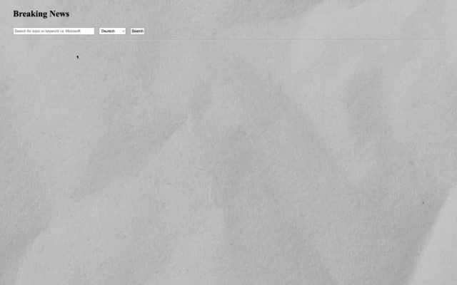

# Project News API

This project intended to learn the usage of APIs in REACT. I created a Webpage that allows the search for specific topics in various languages.
Each Result leads to a new Page with additional information and the link to the news source. To not lose search results, I made sure to open a new tab when
clicking on the source link and also created a secondary main page that refetches the indormation previously entered. For this to work the BACK button needs to be used and not the back function of the browser.

## Newly learned methods

- useParams
- useEffect
- useState

## Tools

## Screenshots

## Demo

## Flowchart / Programmablaufsplan

## Authors

This project was intended to be done solo and was created entirely by me:
[Metin Karakaya](https://github.com/KarakayaMetin8787)
